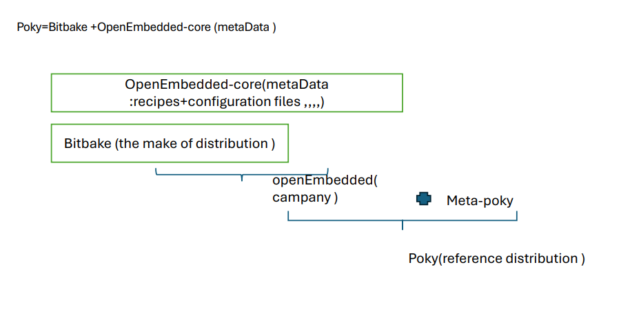
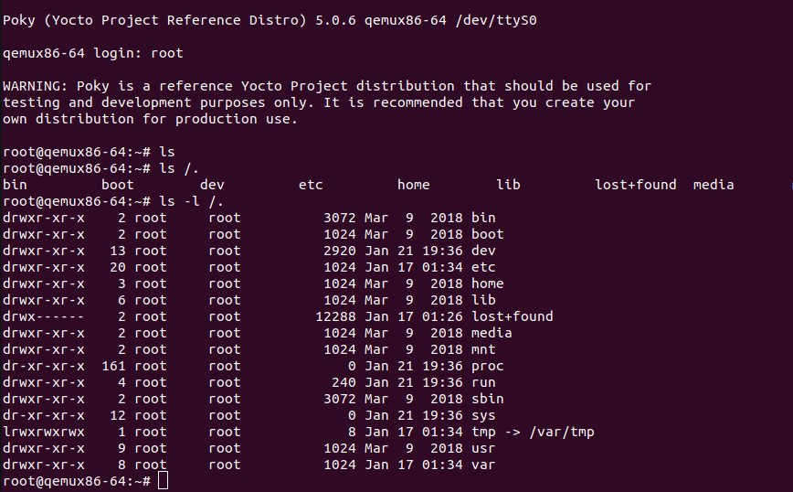

# Yocto QEMU 
The Yocto Project is not a Linux distribution; it creates one for you.
build image linux  for X86-64 architecture  with scarthgap release version 5.0.5

  
### Run the following command:

```bash
runqemu core-image-minimal nographic 
```
  
 
#### 
${CC} : compiler (for example , gcc) defines by  Yocto.
${CFLAGS} : option of  compilation (optimisations, architecture cible, etc.).
${LDFLAGS} : options of  linker to generate compatible binaries.
## 
- recipe for hello.c simple code (fetch source from file /tasks :do-compile ()and do-install()
- recipe for QT/C++  aplication (fetch source from git with the HTTPS  protocol /tasks : do_configure /do_compile /do -install ()
  
about custom -image if you have target (hardware ) so you need copy also bootfs (from core-image-minimal )with rootfs from the custom-image inti SD card . 
